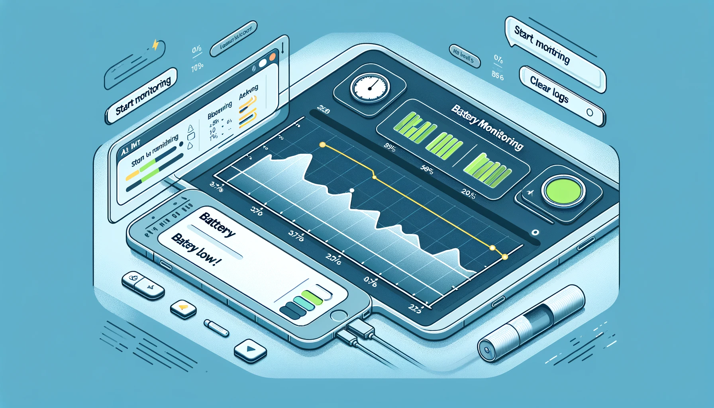

# Battery Monitor

This is a Battery Monitor application that tracks the battery level and charging status of your laptop. It provides notifications for various battery levels and logs battery data over time, displaying it in a graphical format. The application is built using Python and uses the Tkinter library for the graphical user interface (GUI).

## Features

- Monitors battery level and charging status
- Logs battery data with timestamps in an SQLite database
- Provides notifications for specific battery levels
- Displays battery data logs in a scrolled text widget
- Plots battery level over time using Matplotlib

## Prerequisites

- Python 3.x
- Required Python packages: `psutil`, `tkinter`, `matplotlib`, `sqlite3`

## Installation

1. Install Python 3.x from the [official website](https://www.python.org/downloads/).

2. Install the required Python packages using pip:

    ```bash
    pip install psutil matplotlib
    ```

3. Clone or download this repository to your local machine.

## Files Description

- `battery_monitor.py`: Main script that runs the battery monitoring application.
- `run_battery.bat`: Batch script to run the application in the background.
- `run_battery_monitor.pyw`: Python script to start the battery monitor without opening a command window.
- `battery_data.db`: SQLite database file to store battery data (created automatically).

## Usage

### Running the Application

1. Ensure that all the necessary files are in the same directory.
2. Double-click on the `run_battery.bat` file to start the battery monitor application. This script uses `pythonw.exe` to run the application in the background without opening a command window.
3. Alternatively, you can run the main script directly by executing the following command in the terminal:

    ```bash
    python battery_monitor.py
    ```

### Application Interface

1. **Start Monitoring**: Begins monitoring the battery level and charging status.
2. **Stop Monitoring**: Stops monitoring the battery and clears the logged data.
3. **Clear Logs**: Clears the log window.
4. **Log Window**: Displays real-time log messages about battery status.
5. **Battery Level Graph**: Plots the battery level over time.

### Notifications

- Battery level >= 80%: Notification to unplug the charger.
- Battery level <= 30%: Notification to plug in the charger.
- Battery level == 100%: Notification that the battery is fully charged.
- Battery level <= 5%: Critical battery level notification.
- Battery level == 0%: Battery depleted notification.

## Code Explanation

### `battery_monitor.py`

- **Database Functions**:
    - `create_connection()`: Creates a connection to the SQLite database and initializes the table if it doesn't exist.
    - `insert_battery_data()`: Inserts battery data into the database.
    - `fetch_battery_data()`: Fetches battery data from the database.
    - `clear_battery_data()`: Clears all battery data from the database.

- **Notification and Logging Functions**:
    - `send_notification()`: Displays a notification message.
    - `log_message()`: Logs a message in the log window.
    - `clear_logs()`: Clears the log window.

- **Battery Monitoring Functions**:
    - `monitor_battery()`: Continuously monitors the battery status and logs data.
    - `process_log_queue()`: Processes log messages from a queue.
    - `start_monitoring()`: Starts the battery monitoring thread.
    - `stop_monitoring()`: Stops the battery monitoring thread and clears data.
    - `update_log()`: Updates the log window and graph periodically.
    - `update_graph()`: Updates the battery level graph with the latest data.

- **Main Application**:
    - Creates the main Tkinter window and GUI elements.
    - Sets up buttons for starting and stopping monitoring, and clearing logs.
    - Configures a scrolled text widget for logging and a Matplotlib plot for the battery level graph.
    - Schedules periodic updates for the log and graph.

### `run_battery.bat`

- Batch script to run the battery monitor script using `pythonw.exe` to prevent opening a command window.

### `run_battery_monitor.pyw`

- Python script to start the battery monitor without opening a command window using `subprocess.Popen()`.


---
